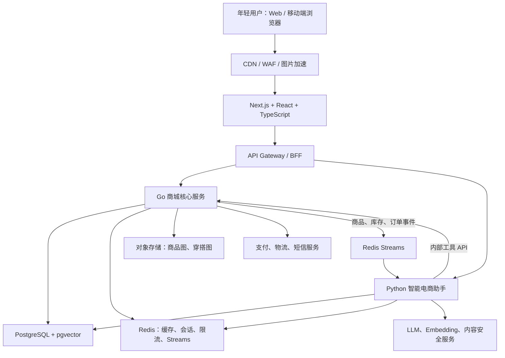

# Wearlo 总体架构

## 目标与原则

Wearlo 面向年轻用户提供穿搭内容、商品搜索、整套搭配、智能导购和交易闭环。系统同时需要保证商品、库存、订单和支付的准确性，以及 AI 推荐的迭代速度。

第一阶段采用“React/TypeScript Web + Go 模块化商城核心 + Python AI 助手”的三层架构。Go 是交易事实来源，Python 专注理解、检索、推荐和对话；在业务规模得到验证前，不拆分大量微服务。

## 总体组件



## 前端 Web

建议使用 Next.js 作为 React/TypeScript 应用框架，以支持商品与穿搭页面的 SEO、服务端渲染、流式加载和客户端交互。

主要模块包括：

- 首页穿搭流、推荐流和活动专题；
- 商品搜索、筛选、详情、收藏和整套购买；
- 购物车、结算、订单和售后；
- AI 穿搭助手的流式对话界面；
- 个人风格、尺码、预算和品牌偏好。

普通商城接口使用 REST/JSON，AI 对话使用 SSE 流式返回。登录态优先采用安全的 HttpOnly Cookie；前端不得持有数据库或模型服务凭据。

## Go 商城核心

Go 服务初期采用模块化单体，一个部署单元内划分清晰领域：

- `identity`：用户、登录、地址和权限；
- `catalog`：商品、SPU、SKU、类目、品牌和标签；
- `inventory`：库存、预占、扣减和释放；
- `pricing`：价格、活动、优惠券和促销规则；
- `cart`：购物车及价格快照；
- `order`：订单、支付、退款和售后；
- `content`：穿搭专题、达人内容和商品关联；
- `event`：Outbox、领域事件和消费幂等。

Go 是商品价格、可售库存和订单状态的最终事实来源。所有写操作需要事务、幂等键和审计记录。

## Python 智能电商助手

Python 服务建议使用 FastAPI，并通过 Agent 编排层组织意图识别、检索、工具调用、推荐解释和流式输出。核心能力包括：

- 理解场景、预算、身材、风格和颜色偏好；
- 混合检索商品并生成单品或整套搭配；
- 根据实时价格、库存和尺码修正推荐；
- 比较商品并解释搭配逻辑；
- 收集点赞、跳过、收藏和购买反馈；
- 经用户确认后调用 Go API 加入购物车。

Python 不得直接修改订单、库存、价格或支付表。涉及交易的动作必须调用 Go 内部工具 API；支付和提交订单始终需要用户明确确认。

## 数据与检索

PostgreSQL 是持久化事实来源，MVP 可使用同一集群、不同 schema：

- `identity`：用户、地址、权限；
- `commerce`：商品、库存、购物车、订单、支付；
- `style`：风格档案、尺码、收藏和行为反馈；
- `ai`：会话、推荐记录、提示词版本和评测；
- `outbox`：待发布领域事件。

商品搜索先使用 PostgreSQL 全文搜索；语义检索通过 pgvector 保存商品和穿搭向量，结合关键词、向量相似度、库存、价格、风格及类目过滤。商品图片和用户上传内容存放在对象存储，不写入数据库大字段。

Redis 仅承载可重建或短期数据：热点缓存、登录会话、限流、短期对话状态、库存热点和 Redis Streams。订单、库存与支付不能只保存在 Redis。

## 核心调用链

### AI 推荐

1. Web 将用户问题和会话 ID 发送给 Python 服务。
2. Python 读取风格档案，执行关键词与向量混合检索。
3. Python 调用 Go 内部 API 校验实时价格、库存和尺码。
4. 模型生成推荐理由，服务通过 SSE 持续返回结果。
5. 用户确认后，Python 调用 Go 将选中 SKU 加入购物车。

### 下单交易

1. Web 直接调用 Go 创建订单。
2. Go 在事务中校验价格、优惠和库存，并写入 Outbox。
3. 支付回调由 Go 验签、幂等处理并更新订单。
4. 订单事件通过 Redis Streams 分发给 AI、通知和分析消费者。

## 安全与可观测性

- 外部接口统一进行认证、授权、限流和参数校验；
- AI 工具调用记录用户、会话、参数、结果和耗时；
- 敏感信息与模型提示词隔离，日志禁止记录密码、令牌和完整支付信息；
- 使用 OpenTelemetry 统一串联 Web、Go、Python 和外部模型调用；
- 对推荐质量维护离线评测集，并监控采纳率、加购率、幻觉率和工具失败率。

## 推荐仓库结构

```text
wearlo/
├── apps/
│   └── web/                    # Next.js + React + TypeScript
├── services/
│   ├── commerce-go/            # Go 商城核心
│   └── assistant-python/       # Python AI 助手
├── contracts/
│   ├── openapi/                # 外部与内部 API 契约
│   └── events/                 # 领域事件结构
├── infra/
│   ├── docker/                 # 本地开发与镜像配置
│   └── migrations/             # 数据库初始化与运维脚本
├── docs/
│   ├── architecture/
│   └── agent/
└── compose.yaml
```

## 演进顺序

1. **工程骨架**：建立 Monorepo、Docker Compose、统一认证、OpenAPI 契约和 CI。
2. **最小闭环**：完成商品浏览、AI 推荐、加入购物车和模拟下单。
3. **交易闭环**：增加库存预占、支付回调、退款、售后和领域事件。
4. **个性化**：完善风格档案、混合检索、反馈学习和推荐评测。
5. **按压力拆分**：只有在容量、团队或发布节奏明确需要时，才拆分库存、订单、搜索等独立服务，并评估 Kafka、Kubernetes 等基础设施。

## 技术参考

- [Next.js App Router](https://nextjs.org/docs/app)
- [FastAPI 异步编程](https://fastapi.tiangolo.com/async/)
- [PostgreSQL 全文搜索](https://www.postgresql.org/docs/current/textsearch.html)
- [pgvector](https://github.com/pgvector/pgvector)
- [Redis Streams](https://redis.io/docs/latest/develop/data-types/streams/)
